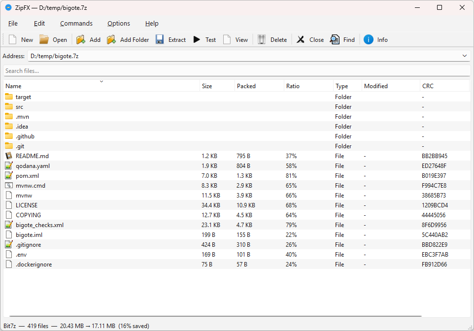

# ZipFX



**A cross-platform archive manager for power users.**

ZipFX is built around the everyday cases — ZIP, 7z, RAR, tar — with the
controls a advanced user actually wants: real compression tuning instead of
a single "level" slider, in-place ZIP edits, a scriptable CLI alongside the
GUI, batch processing, archive conversion/repair, and passwords stored in
the OS keychain instead of a settings file. The engine architecture behind
all that also happens to make outrageous format coverage nearly free —
disc images, game archives, Amiga disks, tracker modules — so it's there
too, as a side effect rather than the point.

---

## Highlights

- **Real compression control for 7z**, not just a slider: method (LZMA2,
  BZip2, PPMd, ...), dictionary size, word size, thread count, and solid
  mode, all exposed in the Create Archive dialog.
- **In-place ZIP editing** — add/delete entries without rewriting the whole
  archive, plus transparent Deflate64 fallback (libzip can't decode it, so
  ZipFX quietly re-reads those entries through the 7-Zip engine).
- **CLI mode** alongside the GUI (`list`, `extract`, `create`, `test`,
  `info`) for scripting, plus batch operations in the GUI for testing or
  extracting every archive in a folder tree.
- **Archive conversion and repair** — convert between formats via
  extract-and-repack, or recover what's readable from a damaged archive.
- **Passwords go in the OS keychain** (Windows Credential Manager / macOS
  Keychain / libsecret), not a plaintext settings file — with AES-256 for 7z.
- **Lazy drag-out on Linux via FUSE** — files are read from the archive on
  demand as the drop target opens them, instead of pre-extracting everything
  before the drag even starts. Works even on Wayland.
- **Checksums on demand** — CRC32 (stored and recomputed) and SHA-256 per
  file, computed in the background with a progress bar.

And, as a side effect of the same pluggable engine architecture:

- **Disc images expose real files, not a blob.** CHD, CDI, GDI, and ISO
  images are parsed down to the actual ISO 9660 filesystem on disc — CD-ROM,
  GD-ROM (Dreamcast), and multi-session DiscJuggler images included. Getting
  there required reverse-engineering the DiscJuggler `.cdi` footer format and
  handling GD-ROM's disc-absolute LBA addressing; see
  [CHD Disc Image Support](#chd-disc-image-support) for the gory details.
  Audio tracks come out as playable WAV files.
- **Native game archive engines**, most with full write support: WAD (Doom),
  PAK (Quake/Half-Life), GRP (Duke Nukem 3D), HOG (Descent), VPK (Source,
  multi-volume), GOB (Dark Forces/Jedi Knight), RFF (Blood), BIG (EA titles),
  POD (Terminal Velocity), MPQ (Blizzard titles), BSA (Bethesda titles).
- **Amiga support via ADFlib** — floppy images (`.adf`, read/write) and hard
  disk images (`.hdf`, RDB-partitioned or plain "hardfile", auto-detected).
- **Tracker modules become listenable** — MOD/S3M/IT/XM/MTM/MED/669/ULT/STM
  sample data is exposed as WAV entries, not just raw bytes.

---

## Supported Formats

### Standard Archive & Compression Formats

| Format | Read | Write | Backend | Notes |
|--------|------|-------|---------|-------|
| ZIP | ✅ | ✅ | libzip | In-place modify; Deflate64 entries transparently re-read via 7z engine |
| JAR, APK, DOCX, XLSX, PPTX, ODT, ODS, ODP, EPUB, WAR, EAR | ✅ | ✅ | libzip | ZIP-based formats |
| 7z | ✅ | ✅ | Bit7z / libarchive | Full write via Bit7z (AES-256, header encrypt, solid, multi-volume, method/dict/threads); read via libarchive fallback |
| RAR / RAR5 | ✅ | ✅ | RarEngine / Bit7z / libarchive | Write via `rar.exe` when installed; read via Bit7z or libarchive |
| ARJ | ✅ | ❌ | Bit7z | Read-only via 7z.dll |
| CAB | ✅ | ❌ | libarchive | |
| LHA / LZH | ✅ | ❌ | libarchive | `.lzh`, `.lha` |
| XAR | ✅ | ❌ | libarchive | |
| CPIO | ✅ | ❌ | libarchive | |
| AR | ✅ | ❌ | libarchive | `.a`, `.deb` |
| WARC | ✅ | ❌ | libarchive | Web archive format |
| MTREE | ✅ | ❌ | libarchive | BSD file hierarchy spec |

### Compressed Tar Variants

| Format | Read | Write | Backend | Extensions |
|--------|------|-------|---------|------------|
| TAR.GZ | ✅ | ✅ | zlib + manual tar | `.tar.gz`, `.tgz`; symlink read/write/extract |
| TAR.BZ2 | ✅ | ❌ | libarchive | `.tar.bz2`, `.tbz2`, `.tbz` |
| TAR.XZ | ✅ | ❌ | libarchive | `.tar.xz`, `.txz` |
| TAR.ZST | ✅ | ❌ | libarchive | `.tar.zst`, `.tzst` |
| TAR.LZ4 | ✅ | ❌ | libarchive | `.tar.lz4` |
| TAR.LZMA | ✅ | ❌ | libarchive | `.tar.lzma` |

### Standalone Compression

| Format | Read | Write | Backend | Notes |
|--------|------|-------|---------|-------|
| GZ | ✅ | ❌ | libarchive | Standalone gzip |
| BZ2 | ✅ | ❌ | libarchive | Standalone bzip2 |
| XZ | ✅ | ❌ | libarchive | Standalone xz |
| ZST | ✅ | ❌ | libarchive | Standalone Zstandard; `.zst`, `.zstd` |
| LZ4 | ✅ | ❌ | libarchive | Standalone LZ4 |
| LZMA | ✅ | ❌ | libarchive | Standalone LZMA |
| Lzip | ✅ | ❌ | libarchive | `.lz`; magic `LZIP` |
| Unix compress | ✅ | ❌ | libarchive | `.Z`; magic `0x1F 0x9D` (LZW) |
| Brotli | ✅ | ❌ | libbrotli | `.br`; extension-only (no standard magic) |
| BSA | ✅ | ❌ | BsaEngine | Bethesda Softworks archives (Oblivion/Fallout 3/NV/Skyrim LE v104, Skyrim SE v105); per-entry zlib compression |

### Game Archive Formats

| Format | Read | Write | Backend | Used By |
|--------|------|-------|---------|---------|
| WAD | ✅ | ✅ | FlatArchiveEngine | Doom (IWAD/PWAD/WAD2/WAD3) |
| PAK | ✅ | ✅ | FlatArchiveEngine | Quake / Half-Life (PACK) |
| GRP | ✅ | ✅ | FlatArchiveEngine | Duke Nukem 3D (KenSilverman) |
| HOG | ✅ | ✅ | FlatArchiveEngine | Descent (HOG) |
| VPK | ✅ | ✅ | FlatArchiveEngine | Valve Source engine; multi-volume `_dir`/`_001.vpk` |
| GOB | ✅ | ✅ | FlatArchiveEngine | Dark Forces / Jedi Knight |
| RFF | ✅ | ✅ | FlatArchiveEngine | Blood (Monolith) |
| BIG | ✅ | ✅ | FlatArchiveEngine | EA games (C&C, FIFA) — `.big`, `.viv` |
| POD | ✅ | ✅ | FlatArchiveEngine | Terminal Velocity / Fury3 |
| MPQ | ✅ | ✅ | StormLib | Warcraft III, StarCraft II, Diablo III, WoW; `.mpq`, `.mpk`, `.w3x`, `.w3m` |
| BSA | ✅ | ❌ | BsaEngine | Bethesda games (Morrowind through Skyrim SE) |

### Tracker Module Formats

| Format | Read | Write | Backend | Notes |
|--------|------|-------|---------|-------|
| MOD | ✅ | ❌ | libxmp (ModEngine) | Protracker modules; detected by magic `M.K.`, `M!K!`, etc. at offset 1080 |
| S3M | ✅ | ❌ | libxmp (ModEngine) | Scream Tracker 3 modules |
| IT | ✅ | ❌ | libxmp (ModEngine) | Impulse Tracker modules; detected by magic `IMPM` |
| XM | ✅ | ❌ | libxmp (ModEngine) | Fast Tracker II eXtended Modules; detected by magic `Extended Module: ` |
| MTM | ✅ | ❌ | libxmp (ModEngine) | MultiTracker modules |
| MED | ✅ | ❌ | libxmp (ModEngine) | Amiga MED/OctaMED modules |
| 669 | ✅ | ❌ | libxmp (ModEngine) | Composer 669 modules |
| ULT | ✅ | ❌ | libxmp (ModEngine) | UltraTracker modules |
| STM | ✅ | ❌ | libxmp (ModEngine) | Scream Tracker 2 modules |

### Disc Image Formats

| Format | Read | Write | Backend | Notes |
|--------|------|-------|---------|-------|
| ISO | ✅ | ❌ | IsoEngine | Self-contained ISO 9660 reader; Joliet (Unicode names); UDF fallback via libarchive; cooked (2048-byte) and raw (2352-byte) sector support |
| CDI | ✅ | ❌ | CdiEngine | DiscJuggler; auto-detects RAW/PQ/CD+G sector types; ISO-9660 parsing or raw `data.iso` fallback |
| GDI | ✅ | ❌ | GdiEngine + IsoEngine | Dreamcast GDI; mounts the ISO 9660 filesystem from the main data track and exposes actual files; falls back to raw track view if no filesystem found |
| CHD | ✅ | ❌ | libchdr | MAME Compressed Hunks of Data; see [CHD Disc Image Support](#chd-disc-image-support) below |
| DMG | ✅ | ❌ | DmgEngine (macOS) / Bit7z (Windows/Linux) | Apple Disk Images; see notes below |
| NRG | ✅ | ❌ | Bit7z | Nero CD images |
| BIN/CUE | ✅ | ❌ | Bit7z | |
| VHD / VHDX | ✅ | ❌ | Bit7z | Magic `conectix` |
| VMDK | ✅ | ❌ | Bit7z | Magic `KDMV` |
| QCOW / QCOW2 | ✅ | ❌ | Bit7z | Magic `QFI\xFB` |

### Retro Disk Image Formats

| Format | Read | Write | Backend | Notes |
|--------|------|-------|---------|-------|
| ADF | ✅ | ✅ | AdfEngine (ADFlib) | Amiga floppy; create 880 KB FFS images |
| HDF | ✅ | ❌ | AdfEngine (ADFlib) | Amiga hard disk images; both RDB-partitioned (`RDSK` magic; mounts the first partition) and non-partitioned "hardfile" images (`DOS` boot block, same format as floppy ADF) |
| D64 / D71 | ✅ | ❌ | D64Engine | Commodore 64/128 disk images; detected by file size (174848 / 175531 / 349696 bytes); C64 DOS directory parsing |
| ATR | ✅ | ❌ | AtrEngine | Atari 8-bit disk images; SIO2PC format |
| SSD / DSD | ✅ | ❌ | SsdEngine | BBC Micro / Acorn disk images |
| DSK | ✅ | ❌ | DskEngine | Multi-format retro disks: Apple DOS 3.3, ProDOS, TeleDisk `.td0`, IMD `.imd`, DC42 `.dc42`, 2MG `.2mg`, generic `.d80`, `.d82` |
| FAT12 Floppy | ✅ | ❌ | FatEngine | FAT12 floppy images; `.img`, `.ima`, `.st`, `.vfd` |

### Additional Formats (via Bit7z / 7z.dll)

APFS, ARJ, BIN/CUE, CHM, COFF, CRAMFS, DCS, DEX, ELF, EXT,
FAT, FLV, GPT, HFS, HXS, IHEX, MBR, Mach-O, MSI, NES, NRG, NSIS,
NTFS, PE, RPM, SquashFS, SWF, TE, UDF, UEFI, VDI, VHD / VHDX,
WIM, and many more formats that 7-Zip supports.

(DMG has its own dedicated row above — `DmgEngine` mounts a real
filesystem on macOS; Windows/Linux use this generic Bit7z path instead.)

---

## 7-Zip Engine (Bit7z)

The Bit7z backend handles formats not covered by libarchive (ARJ, DMG,
MSI, NRG, VHD, VMDK, etc.) and provides full **7z creation** with:

- **AES-256 encryption** with optional header encryption
- **Compression method** — Copy, Deflate, Deflate64, BZip2, LZMA, LZMA2, PPMd
- **Dictionary size** — 256 KB → 1 GB
- **Word size** and **thread count** tuning
- **Solid mode** toggle
- **Multi-volume** output

It also provides transparent **Deflate64 fallback for ZIP** files: if
libzip encounters an entry compressed with method 9 (Deflate64), it
automatically delegates the read to Bit7z.

It requires the 7-Zip shared library at runtime:

| Platform | Library | Source |
|----------|---------|--------|
| Windows | `7z.dll` | [7-Zip](https://www.7-zip.org/) installation or `lib/win/` |
| Linux | `lib7z.so` | Ubuntu `7zip` package or build from [p7zip source](https://github.com/p7zip-project/p7zip) |
| macOS | `lib7z.so` | Build from [p7zip source](https://github.com/p7zip-project/p7zip) (`CPP/7zip/Bundles/Format7zF/makefile.gcc`) |

If the library is not found, Bit7z-based formats will be unavailable but all other engines continue to work normally.

---

## ISO 9660 / UDF / GDI Filesystem Support

ZipFX includes a self-contained **ISO 9660 reader** (`Iso9660Reader`) shared
by `IsoEngine` (`.iso` files), `GdiEngine` (Dreamcast `.gdi` images), and
`ChdEngine` (CD-ROM/GD-ROM `.chd` images):

- Scans Volume Descriptors from LBA 16; prefers a **Joliet** Supplementary
  Volume Descriptor (Unicode filenames, UCS-2 BE → UTF-8) over the
  standard PVD (ASCII, `;1` version suffix stripped)
- Handles both **2048-byte cooked** sectors and **2352-byte raw** sectors
  (Mode 1 header=16 bytes, Mode 2 Form 1 header=24 bytes), detected at
  open time from the sync pattern
- **UDF fallback**: if no ISO 9660 VD is found, scans sectors 16–32 (and
  sector 256) for an `NSR02`/`NSR03` Volume Recognition Area descriptor. On
  a hit, opens the image through libarchive's ISO/UDF handler, which covers
  UDF 1.02 through 2.60 (DVD-Video, BD-ROM, etc.)
- **GDI**: picks the data track with the highest LBA (the main data area on
  Dreamcast discs), mounts its ISO 9660 filesystem, and exposes actual
  files. Falls back to the raw-track view for audio-only discs or
  unrecognised sector formats
- **Cycle-safe directory walking** — a visited-LBA set guards against a
  crafted or corrupt disc image whose directory records reference an
  ancestor or themselves, which would otherwise recurse indefinitely

---

## CHD Disc Image Support

`ChdEngine` (via **libchdr**) exposes MAME CHD images (CD-ROM, GD-ROM,
HDD, DVD, raw) as browsable archive entries rather than one opaque blob:

- **CD-ROM / GD-ROM discs**: mounts the ISO 9660 filesystem from each
  non-audio data track using `Iso9660Reader`, so the actual files on the
  disc are listed and extractable. GD-ROM (Dreamcast) discs are detected
  via the `CHGD` metadata tag (in addition to the standard `CHT2`/`CHTR`
  tags) and use disc-absolute LBA addressing for their filesystem, unlike
  ordinary CD-ROM tracks whose filesystem LBAs are relative to that
  track's own start. Discs with more than one filesystem (GD-ROM has both
  a small system-info area and the large game-data area) mount each one
  under its own `Track NN/` folder.
- **Audio tracks** (CD-DA) are exposed as playable `.wav` entries. CD audio
  is stored big-endian on disc; ZipFX byte-swaps it to little-endian PCM
  and wraps it in a standard 44-byte WAV header before exposing it.
- **Raw-track + CUE fallback**: if no ISO 9660 filesystem can be mounted
  (e.g. non-ISO9660 game filesystems like PC Engine CD's proprietary
  format), each track is still exposed as a raw `Track NN.bin`/`.wav`
  entry, plus a synthesized `.cue` sheet describing the track layout.
  Because each track gets its own `FILE` statement in the cue sheet,
  every `INDEX 01` is `00:00:00` (relative to that file's own start) —
  this is correct multi-FILE cue sheet syntax, not a bug; pregap frames
  aren't physically stored in the CHD and so are correctly omitted.
- **Frame-accurate addressing**: CD sectors in a CHD are physically stored
  as fixed 2448-byte frames (2352-byte raw sector + 96-byte subcode data),
  regardless of the track's declared TYPE (MODE1, MODE1_RAW, MODE2,
  MODE2_FORM1/FORM2/FORM_MIX, MODE2_RAW, AUDIO) — the engine computes the
  correct `headerOff`/`userSize` per sector type to locate the "cooked"
  user data within each raw frame.
- **Efficient partial reads**: previewing a file only decompresses the
  hunks actually covered by the requested byte range (via a single-hunk
  decode cache), instead of decompressing the entire entry to show a
  64 KB preview.
- Write support is not implemented (CHD is read-only in ZipFX).

---

## DMG (Apple Disk Image) Support

DMG support differs by platform, since actually mounting a UDIF image
requires macOS:

- **macOS**: `DmgEngine` mounts the image via `hdiutil` and walks the
  resulting HFS+/APFS filesystem directly, so real files are listed and
  extractable, same as any other archive. Available via **File → Open**
  only — ZipFX does not register itself as a system handler for `.dmg`
  (macOS already has strong opinions about what opens disk images).
- **Windows / Linux**: falls back to `Bit7z`, which parses the UDIF
  container structure via 7-Zip's DMG codec but does not mount a real
  filesystem, so behavior can vary by image (compression type, whether
  it's a plain HFS+ image vs. an APFS/encrypted one, etc.).

---

## Building

### Requirements

- **CMake** ≥ 3.20
- **C++20** compiler (GCC, Clang, MSVC, MinGW)
- **Qt6** (Widgets module)

### Dependencies

The following are fetched automatically by CMake via `FetchContent`:

- **zlib** — gzip compression
- **bzip2** — bzip2 compression
- **liblzma** (xz-utils) — xz/lzma compression
- **libzstd** — Zstandard compression
- **liblz4** — LZ4 compression
- **libzip** — ZIP read/write
- **libarchive** — 7z, RAR, CAB, LHA, XAR, CPIO, AR, WARC, compressed tars, standalone compression; UDF fallback for ISO images
- **bit7z** — extended format support via 7-Zip engine
- **ADFlib** — Amiga Disk File (.adf) and hard disk image (.hdf) formats
- **StormLib** — Blizzard MPQ archive format
- **libchdr** — MAME Compressed Hunks of Data (.chd) disc images
- **brotli** — Brotli decompression (.br files)
- **libxmp** — tracker module playback (MOD, S3M, IT, XM, and many more)
- **CLI11** — command-line interface

Only Qt6 must be pre-installed; everything else is fetched and built automatically.

### Build steps

```bash
git clone https://github.com/axelei/ZipFX.git
cd ZipFX
cmake -B build -DCMAKE_PREFIX_PATH=/path/to/Qt6
cmake --build build
```

#### Windows (MinGW)

**Prerequisites:**

1. Install [Qt6](https://www.qt.io/download-qt-installer) — select the **MinGW 64-bit** component and the matching **MinGW toolchain** under *Qt → Tools*.
2. Install [CMake](https://cmake.org/download/) and ensure it is on your `PATH`.
3. *(Optional)* Install [7-Zip](https://www.7-zip.org/) if you want Bit7z support at runtime.

Use Qt's MinGW toolchain, not the one bundled with CLion (CLion's
bundled MinGW has incompatible `off_t`/`mode_t` definitions that
break libarchive and libzip).

```bat
set PATH=C:\Qt\6.x.x\mingw_64\bin;C:\Qt\Tools\mingw1310_64\bin;%PATH%

cmake -B build -G "MinGW Makefiles" ^
    -DCMAKE_PREFIX_PATH=C:/Qt/6.x.x/mingw_64
cmake --build build
```

**CLion users:** Go to **Settings → Build, Execution, Deployment →
Toolchains** and change the toolchain to `C:\Qt\Tools\mingw1310_64`.
Then **File → Reload CMake Project**. If CMake compiler detection
still picks Gow's `make.exe`, set Environment in CMake settings to
`PATH=C:\Qt\Tools\mingw1310_64\bin;%PATH%`.

#### macOS

**Prerequisites:**

1. Install [Homebrew](https://brew.sh/) if not already present.
2. Install Qt6 and the Xcode Command Line Tools:

```bash
xcode-select --install
brew install qt cmake
```

```bash
cmake -B build -DCMAKE_PREFIX_PATH=$(brew --prefix qt)
cmake --build build
```

#### Linux

**Prerequisites (Debian/Ubuntu):**

```bash
sudo apt install cmake build-essential qt6-base-dev libgl1-mesa-dev libfuse3-dev
```

**Prerequisites (Fedora/RHEL):**

```bash
sudo dnf install cmake gcc-c++ qt6-qtbase-devel mesa-libGL-devel fuse3-devel
```

**Prerequisites (Arch Linux):**

```bash
sudo pacman -S cmake base-devel qt6-base mesa fuse3
```

> `libfuse3-dev` / `fuse3-devel` / `fuse3` is optional. Without it, dragging files out of an archive pre-extracts them to a temp directory before the drag starts. With it, files are read from the archive on demand as the drop target opens them (lazy extraction).

```bash
cmake -B build
cmake --build build
```

### macOS Gatekeeper

If macOS blocks the app because it is not notarized:

```bash
xattr -rd com.apple.quarantine /path/to/ZipFX.app
```

Or codesign it yourself:

```bash
codesign --force --deep --sign - /path/to/ZipFX.app
```

---

## CI / Releases

Releases are built automatically on GitHub Actions when a version tag is pushed (`v1.2.3` or `1.2.3`). Three platform jobs run in parallel:

| Platform | Runner | Output |
|----------|--------|--------|
| Windows | `windows-latest` (MinGW) | NSIS installer + ZIP |
| macOS | `macos-latest` (universal) | DMG |
| Linux | `ubuntu-22.04` | AppImage + tar.gz |

Qt is cached via `jurplel/install-qt-action`; FetchContent sources and build artifacts are cached via `actions/cache` keyed on `CMakeLists.txt`.

```bash
git tag v1.0.0
git push origin v1.0.0
```

---

## Library Placement

Pre-built 7-Zip shared libraries can be placed in `lib/` for automatic
bundling. The expected layout is:

```
lib/
├── win/
│   ├── x64/7z.dll
│   └── arm64/7z.dll
├── linux/
│   ├── x64/lib7z.so
│   └── arm64/lib7z.so
└── macos/
    ├── x64/lib7z.so
    └── arm64/lib7z.so
```

---

## Architecture

```
ArchiveEngine (pure virtual interface)
├── ZipEngine (libzip) — ZIP read/write, in-place modify
│   └── [Bit7zEngine fallback for Deflate64 entries]
├── TarGzEngine (zlib + manual tar) — TAR.GZ read/write; symlink support
├── LibarchiveEngine — parameterised with format/filter registration
│   functions for 7z, RAR, RAR5, CAB, LHA, XAR, CPIO, AR,
│   WARC, MTREE, compressed tars, standalone compression,
│   Unix compress (.Z), Lzip (.lz)
├── Bit7zEngine (7-Zip DLL/SO) — ARJ, DMG, NRG, VHD, VMDK, QCOW2,
│   and many more; 7z write with AES-256, method/dict/threads/solid;
│   Deflate64 ZIP fallback; gracefully absent if DLL not found
├── RarEngine — RAR creation via rar.exe; libarchive/Bit7z read fallback
├── IsoEngine — .iso disc images
│   ├── Iso9660Reader — self-contained ISO 9660 + Joliet parser;
│   │   sector-level I/O via SectorFn callback; handles 2048-byte
│   │   cooked and 2352-byte raw sectors
│   └── [LibarchiveEngine fallback for UDF images]
├── CdiEngine (libarchive + custom callbacks) — DiscJuggler CDI
│   disc images; on-the-fly sector header/ECC stripping, ISO-9660
│   parsing via libarchive, raw fallback for non-ISO content
├── GdiEngine — Dreamcast GDI disc images
│   └── Iso9660Reader — mounts filesystem from main data track;
│       falls back to raw-track view if no filesystem found
├── ChdEngine (libchdr) — MAME CHD disc images (CD-ROM/GD-ROM/HDD/DVD);
│   mounts ISO 9660 filesystem(s) per data track via Iso9660Reader,
│   exposes CD-DA audio tracks as WAV, falls back to raw tracks + a
│   synthesized .cue sheet when no filesystem can be mounted; bounded
│   partial reads for preview (only decodes hunks actually requested)
├── DmgEngine (hdiutil, macOS only) — Apple Disk Images; mounts via
│   hdiutil and walks the real HFS+/APFS filesystem; Windows/Linux use
│   the Bit7zEngine UDIF fallback instead (no real mount)
├── BsaEngine — Bethesda BSA v104/v105 with optional zlib decompression
├── BrotliEngine (libbrotli) — .br decompression (streaming)
├── AdfEngine (ADFlib) — Amiga Disk Files (.adf, read + write FFS) and
│   Amiga hard disk images (.hdf, read-only; RDB-partitioned or
│   non-partitioned "hardfile" — ADFlib's generic device layer
│   auto-detects which)
├── D64Engine — Commodore 64/128 disk images (D64/D71, C64 DOS)
├── AtrEngine — Atari 8-bit disk images (SIO2PC ATR format)
├── SsdEngine — BBC Micro/Acorn disk images (SSD/DSD)
├── DskEngine — multi-format retro disks (Apple DOS, TeleDisk,
│   IMD, DC42, 2MG, generic sector dumps)
├── FatEngine — FAT12 floppy disk images
├── ModEngine (libxmp) — tracker module formats (MOD, S3M, IT, XM, etc.);
│   raw sample PCM exposed as WAV entries; song message and instrument
│   names in archive comment
├── FlatArchiveEngine (base class for headerless game archives)
│   ├── WadEngine — Doom IWAD/PWAD/WAD2/WAD3
│   ├── PakEngine — Quake PACK
│   ├── GrpEngine — Duke Nukem 3D GRP
│   ├── HogEngine — Descent HOG
│   ├── VpkEngine — Valve VPK (multi-volume _dir/_001.vpk)
│   ├── GobEngine — Dark Forces / Jedi Knight GOB
│   ├── RffEngine — Blood RFF
│   ├── BigEngine — EA games BIG/VIV
│   └── PodEngine — Terminal Velocity POD
├── MpqEngine (StormLib) — Blizzard MPQ
│   (Warcraft III, StarCraft II, Diablo III, WoW)
└── [Bit7z fallback] — last-resort auto-detect via 7z.dll
```

- **Format detection** uses magic bytes first (`FileSignature` table),
  then extension fallback. All format metadata is in a single
  `kFormats[]` table in `ArchiveEngineFactory.cpp`.
- **Extension registry** — `src/engine/ArchiveExtensions.h` is the single
  source of truth for all recognised file extensions. It is consumed by
  `ArchiveEngineFactory::SupportedExtensions()`, `registerFileAssociations()`
  (Windows registry), and the Windows shell extension context-menu filter.
- **Write support on flat archives** uses a common `doSave()` virtual
  method. Each subclass writes its own binary layout (header + entries
  + data). Data is cached lazily — existing entries are read from the
  original file only when `Save()` is called.
- **Save runs on a worker thread** to keep the UI responsive. Progress
  is reported via `SaveProgressCb` callback. Cancel sets an atomic flag
  that engines check at safe abort points.
- **CLI mode** is detected by argv pattern matching before Qt starts.
  Supports `list`, `extract`, `create`, `test`, `info` subcommands.

---

## CLI Usage

```bash
zipfx list archive.zip
zipfx extract archive.7z -o /tmp/out
zipfx create output.zip file1.txt file2.txt
zipfx create output.7z --password secret --encrypt-headers file.dat
zipfx create output.adf file.txt                   # ADF floppy image
zipfx test archive.rar
zipfx info archive.iso
zipfx --cli list archive.cab
```

---

## Translations

ZipFX supports **16 languages**: English, Spanish, French, German,
Italian, Portuguese, Dutch, Swedish, Norwegian, Danish, Finnish,
Russian, Japanese, Chinese, Korean, Arabic.

The language menu shows flag emojis with native language names.
The preference is persisted via `QSettings`.

Translation files are in `translations/`. To add a new language:

```bash
lupdate src/ -ts translations/zipfx_<code>.ts
# Edit the .ts file
lrelease translations/zipfx_<code>.ts
```

The `.qm` files are generated at build time via CMake's `file(GLOB *.ts)`
+ `lrelease` pipeline, and loaded at startup from several paths relative
to the executable.

> **Note:** Most translations are machine-generated and may contain
> inaccuracies. If you spot an error or want to improve a translation,
> please open a pull request — human contributions are very welcome!

---

## Acknowledgements

- [Qt](https://www.qt.io/) — cross-platform UI framework
- [libzip](https://libzip.org/) — ZIP archive library
- [libarchive](https://www.libarchive.org/) — multi-format archive library
- [zlib](https://zlib.net/) — compression library
- [bzip2](https://sourceware.org/bzip2/) — bzip2 compression library
- [xz-utils / liblzma](https://tukaani.org/xz/) — xz/lzma compression library
- [Zstandard](https://facebook.github.io/zstd/) by Facebook — fast compression library
- [LZ4](https://lz4.org/) by Yann Collet — extremely fast compression library
- [Brotli](https://github.com/google/brotli) by Google — Brotli compression library
- [Bit7z](https://github.com/rikyoz/bit7z) — 7-Zip engine C++ wrapper
- [7-Zip](https://www.7-zip.org/) by Igor Pavlov — 7z compression engine
- [p7zip](https://github.com/p7zip-project/p7zip) — 7-Zip port for POSIX systems
- [ADFlib](https://github.com/adflib/ADFlib) — Amiga Disk File library
- [StormLib](https://github.com/ladislav-zezula/StormLib) by Ladislav Zezula — Blizzard MPQ archive library
- [libchdr](https://github.com/rtissera/libchdr) — MAME Compressed Hunks of Data library
- [libxmp](https://github.com/libxmp/libxmp) — Extended Module Player library
- [CLI11](https://github.com/CLIUtils/CLI11) — command-line parser

---

## AI Attribution

Large portions of this codebase were generated with the assistance of
large language models (Anthropic Claude, OpenAI ChatGPT). The human
author reviewed, tested, and refined all generated code.

---

## License

GPLv3 — see [LICENSE](LICENSE).
